<p align="center">
  <a href="https://shop.freshapp.io">
    
  </a>
</p>

<p align="center">
  <a href="#francais">🇫🇷 Français</a> · <a href="#english">🇬🇧 English</a>
</p>

---

<a id="francais"></a>
## 🇫🇷 Français

# 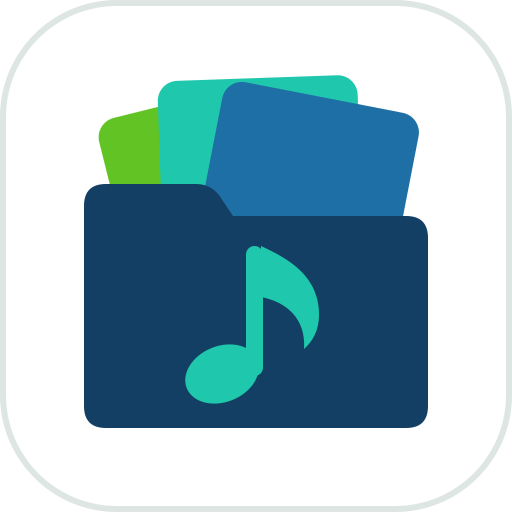 Freshapp.io Music Tagger

Application web (Docker) pour nettoyer les tags d'une grosse bibliothèque MP3,
typiquement servie par [Navidrome](https://www.navidrome.org/).

- **Nom technique** : `freshapp-music-tagger`
- **Version** : 1.6.1
- **Auteur** : FreshApp.io

### Fonctionnement

L'application scanne une arborescence et considère **chaque dossier contenant
des MP3 comme un album**. Elle détecte :

| Page | Ce qui est détecté |
|---|---|
| **Non taggués** | fichiers sans tag ID3, ou sans artiste / titre / album |
| **Various Artists** | album artist ou artiste « Various Artists » (VA, Divers…), sauf les vraies compilations déjà propres |
| **Tags incohérents** | dans un même dossier : album artist, nom d'album, année ou ID MusicBrainz différents — ce qui fait éclater l'album en plusieurs dans Navidrome |
| **Doublons** | même album présent dans plusieurs dossiers |
| **Genres** | genres écrits de mille façons (`Hip-Hop/Rap`, `Rap & Hip-Hop`, `hiphop`…), génériques (`Other`, `Unknown`) ou farfelus |

Pour chaque dossier, une **suggestion** est calculée avec un niveau de confiance :
artiste majoritaire (hors « feat. »), album et année majoritaires ou déduits du
nom du dossier, titres et numéros de piste déduits des noms de fichiers.

### Corriger

- **En lot** : filtrer (par exemple « suggestion sûre »), tout sélectionner, appliquer.
- **Album par album** : le mode revue fait défiler les albums du filtre un par un,
  suggestion pré-remplie et modifiable, avec *Valider et suivant*, *Passer*,
  *Ne plus proposer* (raccourcis Ctrl+Entrée, Ctrl+→, Ctrl+I), et *Enregistrer*
  (Ctrl+S) pour écrire les modifications en restant sur l'album.
- **Tag auto** : sur une liste (par ex. les non taggués), l'app cherche chaque
  album sur MusicBrainz et lui donne une **note de confiance** sur 100 (durées,
  titres, noms). Les albums au-dessus de la note minimale choisie sont
  présélectionnés ; un album est dit *ambigu* si un autre album obtient une note
  proche, et n'est alors jamais présélectionné. Options : album artist de
  MusicBrainz, du dossier ou imposé, genre vide complété, pochette, ne remplir que
  les champs vides.
- **Piste par piste** : pour les compilations, chaque morceau se tague et
  s'enregistre séparément, avec suggestion depuis le nom de fichier ou recherche
  du morceau sur MusicBrainz.
- **MusicBrainz** : recherche de l'album par nom **et par durées des pistes**
  (comme la recherche freedb de Mp3tag : les durées et l'ordre des morceaux
  suffisent, même sans aucun tag, pour retrouver les éditions CD
  correspondantes), association fichiers ↔ pistes
  (numéro, titre, durée), tags complets avec identifiants MusicBrainz, pochette
  depuis Cover Art Archive. Les modifications en cours (genre…) sont enregistrées
  avant, et le genre n'est jamais écrasé.
- **Doublons** : la version de meilleure qualité est présélectionnée (bitrate,
  nombre de pistes, pochette, tags complets) ; les autres vont à la corbeille.
- **Genres** : chaque valeur est rapprochée d'une liste de genres cibles
  modifiable. Les genres vides ou farfelus reprennent le genre habituel de
  l'artiste, du dossier, ou celui trouvé sur MusicBrainz.
- **Écoute** : lecteur intégré sur chaque piste.
- **Thème** : clair, sombre, ou automatique (suit le système), au choix en bas du menu.
- **Langue** : interface en français ou en anglais (sélecteur FR / EN ; par défaut, la langue du navigateur).
- **Emplacement** : en éditant un album, le chemin du dossier (cliquable) et les autres albums du même dossier.

### Captures d'écran

| | |
|---|---|
| <a href="docs/screenshots/fr/light/dashboard.png"><picture><source media="(prefers-color-scheme: dark)" srcset="docs/screenshots/fr/dark/dashboard.png">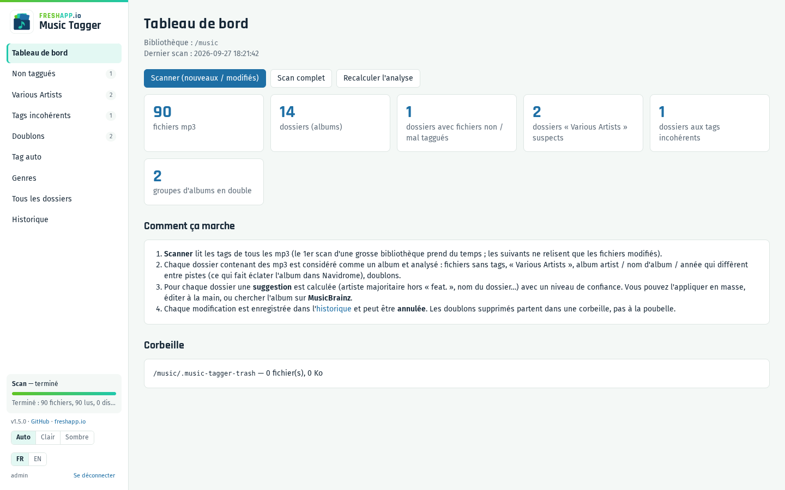</picture></a> | <a href="docs/screenshots/fr/light/various.png"><picture><source media="(prefers-color-scheme: dark)" srcset="docs/screenshots/fr/dark/various.png">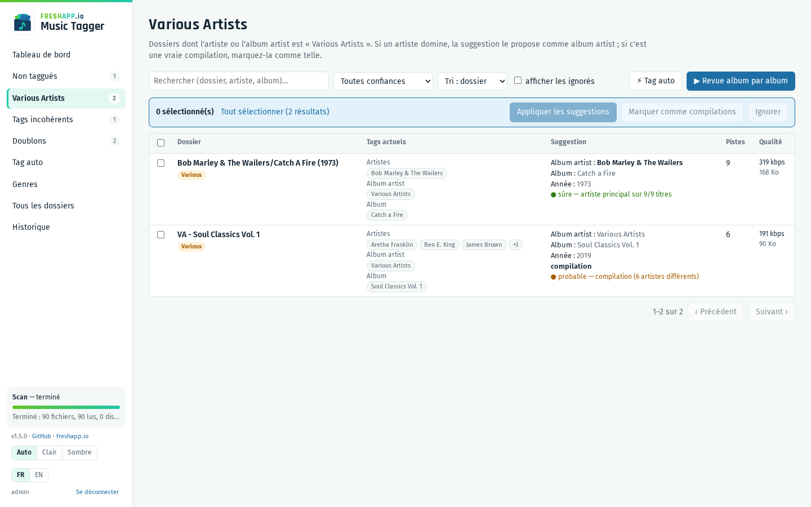</picture></a> |
| **Tableau de bord** : les problèmes détectés dans la bibliothèque | **Various Artists** : suggestion d'album artist et niveau de confiance |
| <a href="docs/screenshots/fr/light/autotag.png"><picture><source media="(prefers-color-scheme: dark)" srcset="docs/screenshots/fr/dark/autotag.png">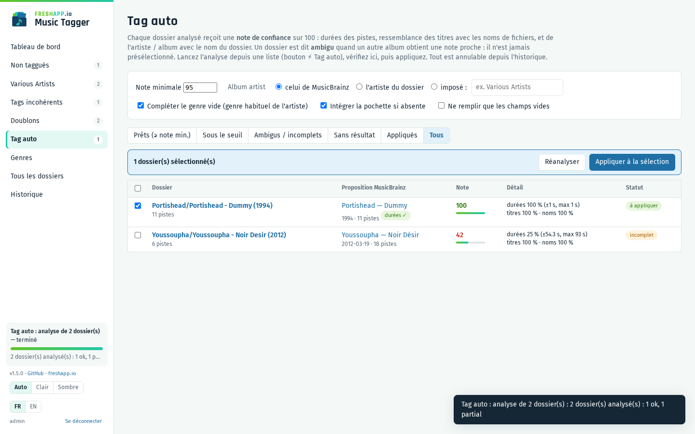</picture></a> | <a href="docs/screenshots/fr/light/review.png"><picture><source media="(prefers-color-scheme: dark)" srcset="docs/screenshots/fr/dark/review.png">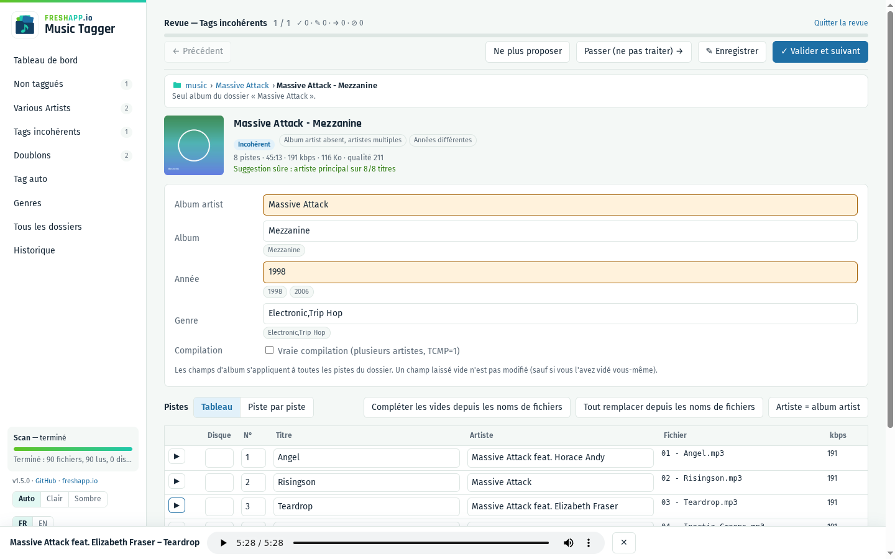</picture></a> |
| **Tag auto** : note de confiance, présélection au-dessus du seuil | **Revue album par album**, avec le lecteur intégré |
| <a href="docs/screenshots/fr/light/musicbrainz.png"><picture><source media="(prefers-color-scheme: dark)" srcset="docs/screenshots/fr/dark/musicbrainz.png">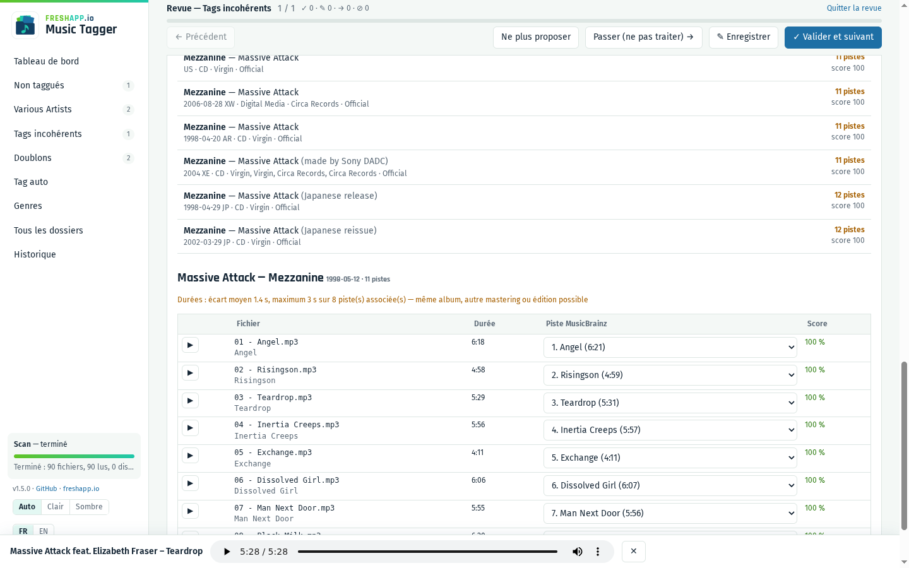</picture></a> | <a href="docs/screenshots/fr/light/track-by-track.png"><picture><source media="(prefers-color-scheme: dark)" srcset="docs/screenshots/fr/dark/track-by-track.png">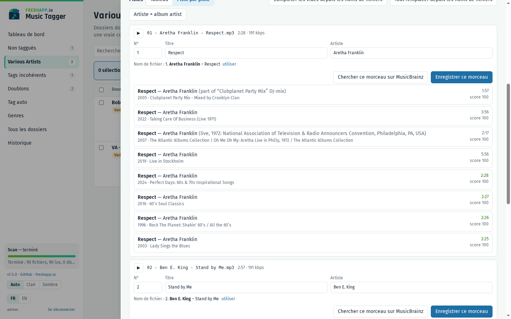</picture></a> |
| **MusicBrainz** : association fichiers ↔ pistes (titre + durée) | **Piste par piste** pour les compilations, recherche du morceau |
| <a href="docs/screenshots/fr/light/duplicates.png"><picture><source media="(prefers-color-scheme: dark)" srcset="docs/screenshots/fr/dark/duplicates.png">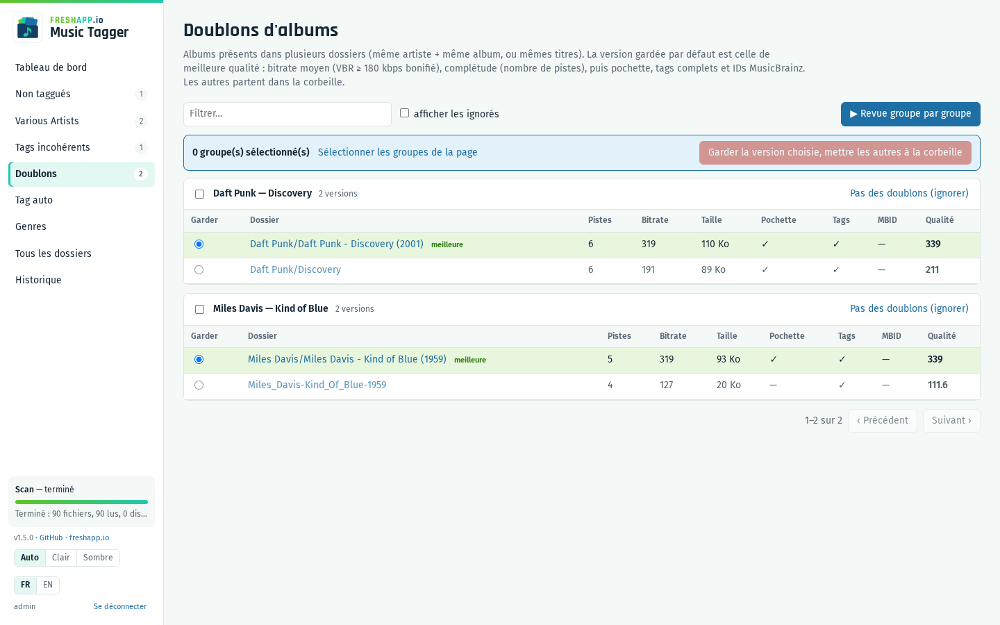</picture></a> | <a href="docs/screenshots/fr/light/genres.png"><picture><source media="(prefers-color-scheme: dark)" srcset="docs/screenshots/fr/dark/genres.png">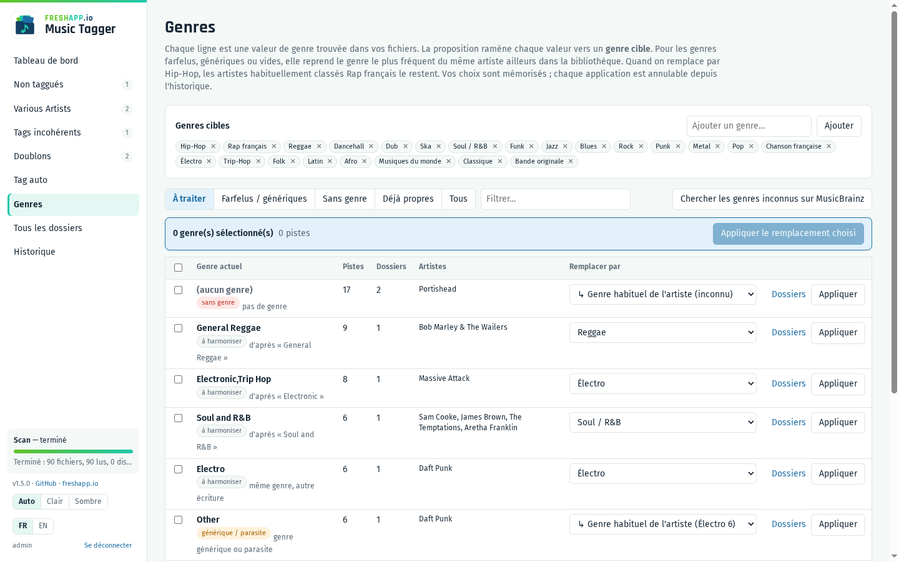</picture></a> |
| **Doublons** : la meilleure version est présélectionnée | **Genres** : chaque valeur ramenée vers un genre cible |

Captures réalisées sur la bibliothèque de démonstration générée par
`tools/demo_library.py` ; elles s'affichent en clair ou en sombre selon le
thème de GitHub.

### Sécurité des données

- Chaque écriture est journalisée avec l'ancienne valeur de chaque champ :
  **Historique → Annuler** restaure les tags.
- Rien n'est supprimé : les doublons sont **déplacés** dans
  `.music-tagger-trash/` à la racine de la bibliothèque, avec un fichier
  `.ndignore` pour que Navidrome l'ignore. Annulable tant que la corbeille
  n'est pas vidée.
- Seuls les champs modifiés sont réécrits ; la version ID3 existante (2.3 / 2.4)
  est conservée.
- Un scan ne retire jamais de l'index le contenu d'un dossier devenu
  illisible, et s'interrompt si la bibliothèque est vide ou inaccessible.

### Identification

L'application est protégée par un identifiant et un mot de passe (un seul compte).
Toutes les pages et l'API le demandent, y compris l'écoute et les pochettes.

- Définir `APP_USER` et, de préférence, `APP_PASSWORD_HASH` dans `.env` :
  ```bash
  docker compose run --rm music-tagger python -m app.auth hash
  ```
  (`APP_PASSWORD` en clair est aussi accepté.)
- Sans mot de passe configuré, un mot de passe est généré au premier démarrage,
  affiché dans les logs (`docker compose logs`) et conservé dans
  `data/generated-password.txt`.
- Session par cookie signé (HttpOnly, SameSite=Strict), valable 30 jours,
  invalidée si le mot de passe change. 5 échecs de connexion bloquent l'adresse
  IP pendant 15 minutes.
- **Exposition sur Internet** : passer par un reverse proxy HTTPS (Traefik,
  Caddy, Nginx Proxy Manager…). Le cookie est alors marqué `Secure`
  automatiquement (`COOKIE_SECURE=auto`, via `X-Forwarded-Proto`).

### Installation

```bash
git clone https://github.com/Freshapp-io/music-tagger.git
cd music-tagger
cp .env.example .env    # puis éditer
docker compose up -d --build
```

Ouvrir ensuite `http://<hôte>:8085` et lancer un **scan**.

L'accès à la bibliothèque se règle uniquement dans `.env` (`docker-compose.yml`
reste intact, ce qui permet de mettre à jour par `git pull`) :

- **A) Sur le NAS** (recommandé, accès disque local) : `MUSIC_DEVICE` = dossier
  qui contient la bibliothèque, `MUSIC_SUBDIR` = éventuel sous-dossier.
- **B) Sur une autre machine** (PC, Docker Desktop, WSL) : le conteneur monte
  lui-même le partage SMB (`MUSIC_MOUNT_TYPE=cifs`, voir `.env.example`). Un
  lecteur réseau Windows (`Z:\`) n'est pas visible par Docker.

L'image fonctionne sur **amd64 et arm64** (Raspberry Pi 4 / 5).

Docker fige la configuration du volume à sa création : après avoir modifié
`MUSIC_DEVICE` ou les options de montage, exécuter
`docker compose down && docker volume rm music-tagger_music` puis relancer
(la musique n'est pas touchée).

Mise à jour :

```bash
git pull && docker compose up -d --build
```

La base (`data/music-tagger.db`) enregistre des chemins relatifs à la
bibliothèque : on peut la copier d'une machine à l'autre en conservant
l'historique, les choix et les dossiers ignorés.

### Configuration

| Variable | Défaut | Rôle |
|---|---|---|
| `APP_USER` | admin | identifiant de connexion |
| `APP_PASSWORD_HASH` / `APP_PASSWORD` | — | mot de passe (haché ou en clair) ; généré s'il est absent |
| `COOKIE_SECURE` | auto | cookie `Secure` : `auto` (si HTTPS), `true`, `false` |
| `MUSIC_DEVICE` | — | dossier (ou partage SMB) qui contient la bibliothèque |
| `MUSIC_MOUNT_TYPE`, `MUSIC_MOUNT_OPTIONS` | `none`, `bind` | montage : dossier local, ou `cifs` + options SMB |
| `MUSIC_SUBDIR` | — | sous-dossier de `MUSIC_DEVICE` qui contient la musique |
| `PUID` / `PGID` | 1000 | utilisateur qui écrit les fichiers |
| `PORT` | 8085 | port web |
| `SCAN_THREADS` | 8 | lectures parallèles pendant le scan |
| `MB_USER_AGENT` | — | contact transmis à MusicBrainz |
| `NAVIDROME_URL`, `NAVIDROME_USER`, `NAVIDROME_PASSWORD` | — | optionnel : bouton « Lancer un scan Navidrome » (compte administrateur) |

La base SQLite (index des tags, historique, choix de genres) est dans `./data`.

### Limites

- Seuls les **MP3** sont traités.
- Un dossier « Artiste » contenant des titres en vrac apparaît comme incohérent :
  il suffit de l'ignorer.
- Les albums multi-CD rangés dans `CD1/`, `CD2/` sont vus comme deux dossiers,
  mais ne sont pas pris pour des doublons.

### Développement

```bash
docker build -t freshapp-music-tagger .
docker run --rm -u 0 -v "$PWD":/src -w /src freshapp-music-tagger \
  sh -c "pip install -q pytest && python -m pytest -q tests"
```

Python 3.12, FastAPI, mutagen, SQLite ; interface en JavaScript sans étape de build (`app/static`).

Retrouvez nos modules sur **[shop.freshapp.io](https://shop.freshapp.io)**.

---

<a id="english"></a>
## 🇬🇧 English

#  Freshapp.io Music Tagger

Dockerised web app to clean up the tags of a large MP3 library, typically
served by [Navidrome](https://www.navidrome.org/).

- **Technical name**: `freshapp-music-tagger`
- **Version**: 1.6.1
- **Author**: FreshApp.io

### How it works

The app scans a folder tree and treats **every folder containing MP3 files as
an album**. It detects:

| Page | What is detected |
|---|---|
| **Untagged** | files without any ID3 tag, or missing artist / title / album |
| **Various Artists** | album artist or artist set to "Various Artists" (VA…), except genuine compilations that are already clean |
| **Inconsistent tags** | within one folder: different album artist, album name, year or MusicBrainz ID — which makes Navidrome split the album |
| **Duplicates** | the same album stored in several folders |
| **Genres** | genres spelled in countless ways (`Hip-Hop/Rap`, `Rap & Hip-Hop`, `hiphop`…), generic (`Other`, `Unknown`) or odd ones |

For each folder a **suggestion** is computed with a confidence level: main
artist (ignoring "feat."), most common album and year or values derived from
the folder name, titles and track numbers derived from file names.

### Fixing

- **In bulk**: filter (e.g. "confident suggestion"), select all, apply.
- **Album by album**: review mode steps through the filtered albums one at a
  time, with the suggestion pre-filled and editable: *Validate and next*,
  *Skip*, *Don't suggest again* (Ctrl+Enter, Ctrl+→, Ctrl+I), and *Save*
  (Ctrl+S) to write the changes while staying on the album.
- **Auto-tagging**: from a list (e.g. untagged folders), every album is looked
  up on MusicBrainz and given a **confidence score** out of 100 (lengths,
  titles, names). Albums above the chosen minimum score are pre-selected; an
  album is *ambiguous* when another album scores close to it, and is then never
  pre-selected. Options: album artist from MusicBrainz, from the folder or
  forced, empty genre filled in, cover art, fill empty fields only.
- **Track by track**: for compilations, each track is tagged and saved on its
  own, with a suggestion from the file name or a MusicBrainz track search.
- **MusicBrainz**: album search by name **and by track lengths** (like
  Mp3tag's freedb lookup: track lengths and order alone find the matching CD
  releases, even with no tags at all), automatic file ↔ track matching (number, title,
  duration), full tags with MusicBrainz IDs, cover art from Cover Art Archive.
  Pending edits (genre…) are saved first, and the genre is never overwritten.
- **Duplicates**: the best-quality version is pre-selected (bitrate, number of
  tracks, cover, complete tags); the others go to the trash folder.
- **Genres**: every value is mapped onto an editable list of target genres.
  Empty or odd genres take the artist's usual genre, the folder's, or the one
  found on MusicBrainz.
- **Listening**: built-in player on every track.
- **Theme**: light, dark, or automatic (follows the system), chosen at the bottom of the menu.
- **Language**: French or English interface (FR / EN switch; defaults to the browser language).
- **Location**: when editing an album, the folder path (clickable) and the other albums of the same folder.

### Screenshots

| | |
|---|---|
| <a href="docs/screenshots/en/light/dashboard.png"><picture><source media="(prefers-color-scheme: dark)" srcset="docs/screenshots/en/dark/dashboard.png">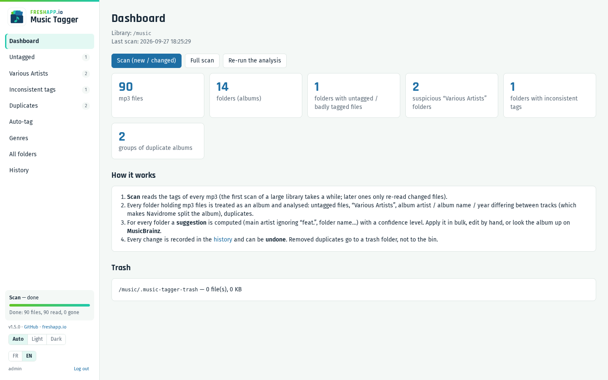</picture></a> | <a href="docs/screenshots/en/light/various.png"><picture><source media="(prefers-color-scheme: dark)" srcset="docs/screenshots/en/dark/various.png">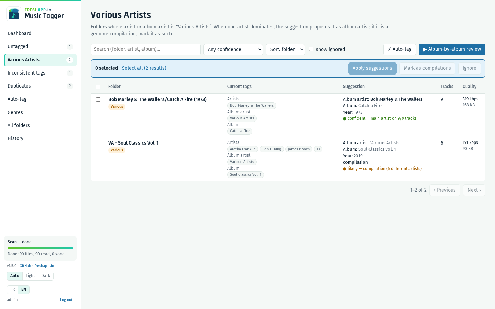</picture></a> |
| **Dashboard**: problems found in the library | **Various Artists**: suggested album artist and confidence level |
| <a href="docs/screenshots/en/light/autotag.png"><picture><source media="(prefers-color-scheme: dark)" srcset="docs/screenshots/en/dark/autotag.png">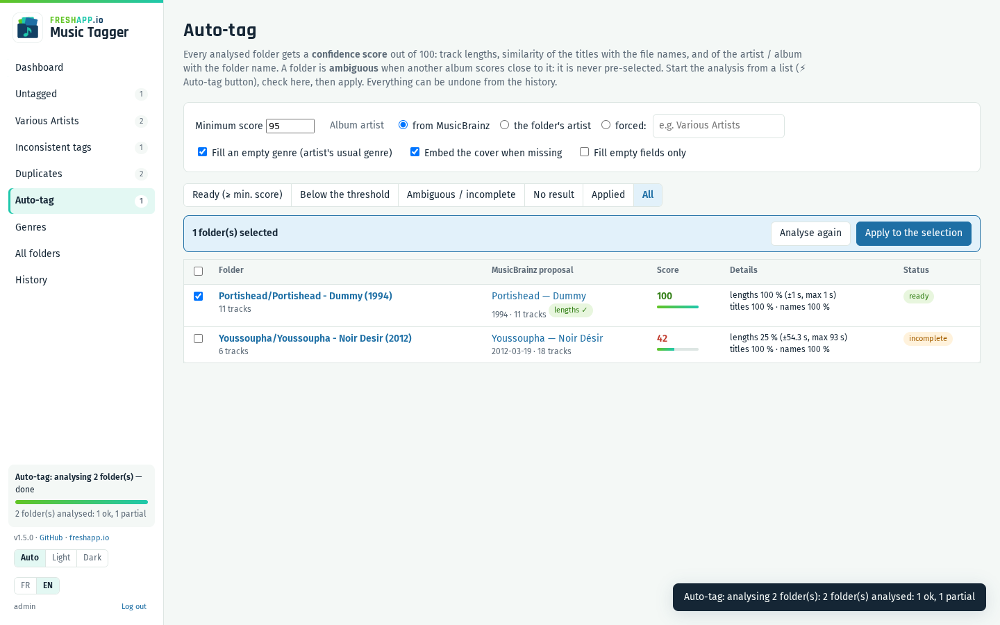</picture></a> | <a href="docs/screenshots/en/light/review.png"><picture><source media="(prefers-color-scheme: dark)" srcset="docs/screenshots/en/dark/review.png">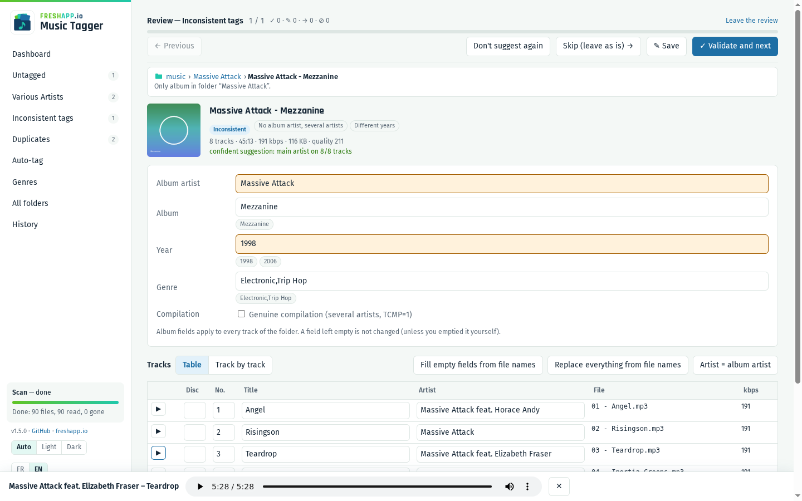</picture></a> |
| **Auto-tagging**: confidence score, pre-selection above the threshold | **Album-by-album review**, with the built-in player |
| <a href="docs/screenshots/en/light/musicbrainz.png"><picture><source media="(prefers-color-scheme: dark)" srcset="docs/screenshots/en/dark/musicbrainz.png">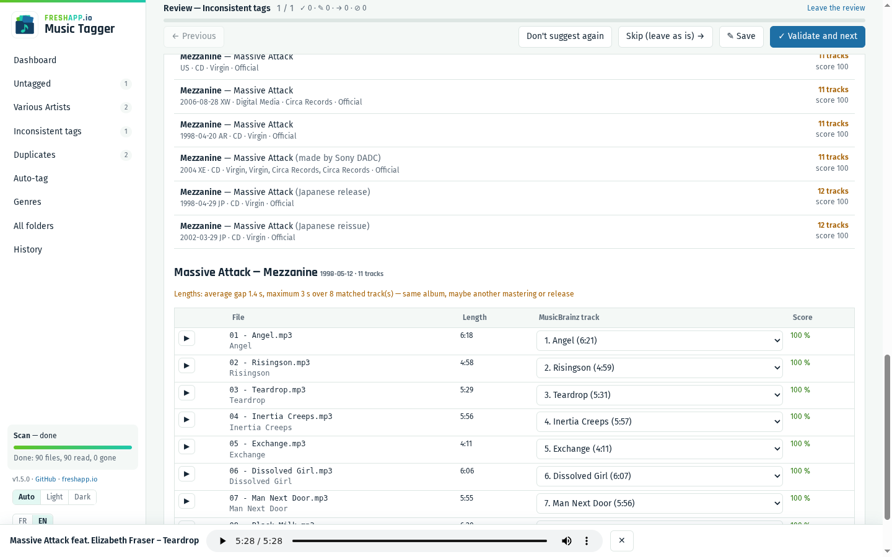</picture></a> | <a href="docs/screenshots/en/light/track-by-track.png"><picture><source media="(prefers-color-scheme: dark)" srcset="docs/screenshots/en/dark/track-by-track.png">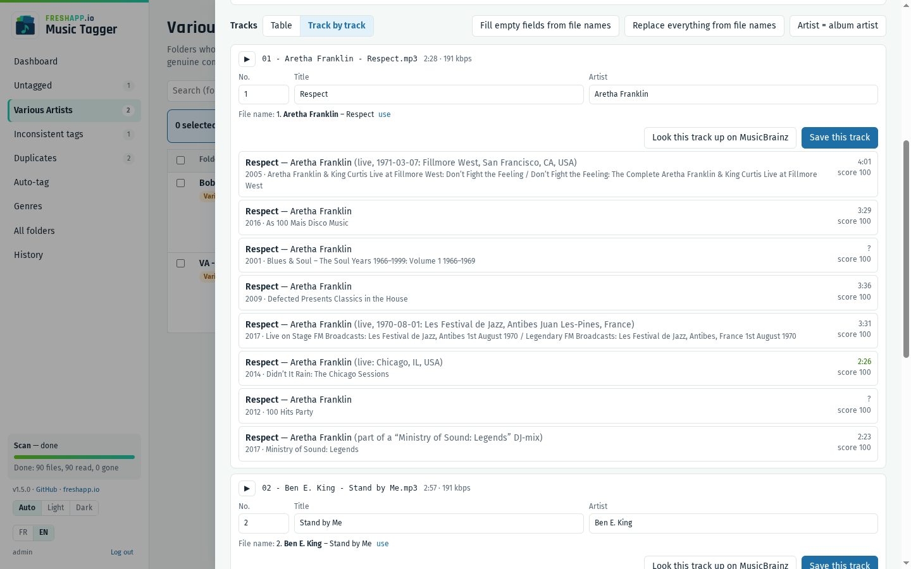</picture></a> |
| **MusicBrainz**: file ↔ track matching (title + duration) | **Track by track** for compilations, with track search |
| <a href="docs/screenshots/en/light/duplicates.png"><picture><source media="(prefers-color-scheme: dark)" srcset="docs/screenshots/en/dark/duplicates.png">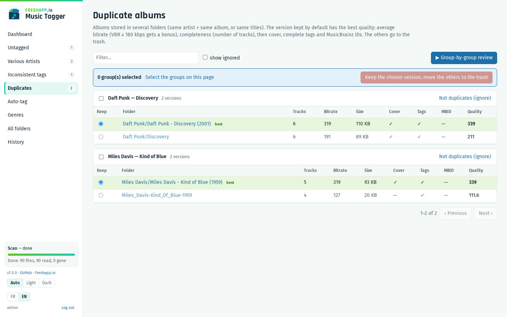</picture></a> | <a href="docs/screenshots/en/light/genres.png"><picture><source media="(prefers-color-scheme: dark)" srcset="docs/screenshots/en/dark/genres.png">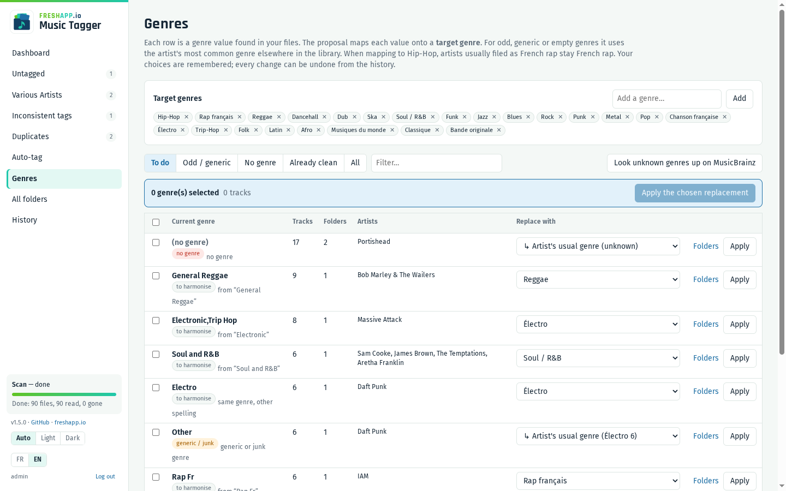</picture></a> |
| **Duplicates**: the best version is pre-selected | **Genres**: every value mapped onto a target genre |

Screenshots taken on the demo library generated by `tools/demo_library.py`;
they follow GitHub's light or dark theme.

### Data safety

- Every write is logged with the previous value of each field:
  **History → Undo** restores the tags.
- Nothing is deleted: duplicates are **moved** to `.music-tagger-trash/` at the
  library root, with an `.ndignore` file so that Navidrome skips it. Undoable
  until the trash is emptied.
- Only modified fields are rewritten; the existing ID3 version (2.3 / 2.4) is
  kept.
- A scan never drops the content of a folder that became unreadable from the
  index, and aborts if the library is empty or unreachable.

### Authentication

The app is protected by a user name and password (single account). Every page
and API call requires it, including playback and cover art.

- Set `APP_USER` and preferably `APP_PASSWORD_HASH` in `.env`:
  ```bash
  docker compose run --rm music-tagger python -m app.auth hash
  ```
  (a plain `APP_PASSWORD` is accepted too.)
- Without any password, one is generated at first start, printed in the logs
  (`docker compose logs`) and kept in `data/generated-password.txt`.
- Signed session cookie (HttpOnly, SameSite=Strict), valid for 30 days,
  invalidated when the password changes. 5 failed logins lock the IP address
  for 15 minutes.
- **Exposing it to the Internet**: put it behind an HTTPS reverse proxy
  (Traefik, Caddy, Nginx Proxy Manager…). The cookie is then flagged `Secure`
  automatically (`COOKIE_SECURE=auto`, via `X-Forwarded-Proto`).

### Installation

```bash
git clone https://github.com/Freshapp-io/music-tagger.git
cd music-tagger
cp .env.example .env    # then edit
docker compose up -d --build
```

Then open `http://<host>:8085` and run a **scan**.

Library access is configured in `.env` only (`docker-compose.yml` stays
untouched, so updating is just a `git pull`):

- **A) On the NAS** (recommended, local disk access): `MUSIC_DEVICE` = folder
  holding the library, `MUSIC_SUBDIR` = optional sub-folder.
- **B) On another machine** (PC, Docker Desktop, WSL): the container mounts the
  SMB share itself (`MUSIC_MOUNT_TYPE=cifs`, see `.env.example`). A Windows
  network drive (`Z:\`) is not visible to Docker.

The image runs on **amd64 and arm64** (Raspberry Pi 4 / 5).

Docker freezes a volume's settings when it is created: after changing
`MUSIC_DEVICE` or the mount options, run
`docker compose down && docker volume rm music-tagger_music`, then start again
(the music itself is not touched).

Updating:

```bash
git pull && docker compose up -d --build
```

The database (`data/music-tagger.db`) stores paths relative to the library: it
can be copied from one machine to another, keeping history, choices and
ignored folders.

### Configuration

| Variable | Default | Purpose |
|---|---|---|
| `APP_USER` | admin | login name |
| `APP_PASSWORD_HASH` / `APP_PASSWORD` | — | password (hashed or plain); generated when missing |
| `COOKIE_SECURE` | auto | `Secure` cookie: `auto` (when HTTPS), `true`, `false` |
| `MUSIC_DEVICE` | — | folder (or SMB share) holding the library |
| `MUSIC_MOUNT_TYPE`, `MUSIC_MOUNT_OPTIONS` | `none`, `bind` | mount: local folder, or `cifs` + SMB options |
| `MUSIC_SUBDIR` | — | sub-folder of `MUSIC_DEVICE` holding the music |
| `PUID` / `PGID` | 1000 | user that writes the files |
| `PORT` | 8085 | web port |
| `SCAN_THREADS` | 8 | parallel reads during a scan |
| `MB_USER_AGENT` | — | contact sent to MusicBrainz |
| `NAVIDROME_URL`, `NAVIDROME_USER`, `NAVIDROME_PASSWORD` | — | optional: "Start a Navidrome scan" button (admin account) |

The SQLite database (tag index, history, genre choices) lives in `./data`.

### Limitations

- Only **MP3** files are handled.
- An "Artist" folder holding loose tracks shows up as inconsistent: just
  ignore it.
- Multi-disc albums stored in `CD1/`, `CD2/` are seen as two folders, but are
  not reported as duplicates.

### Development

```bash
docker build -t freshapp-music-tagger .
docker run --rm -u 0 -v "$PWD":/src -w /src freshapp-music-tagger \
  sh -c "pip install -q pytest && python -m pytest -q tests"
```

Python 3.12, FastAPI, mutagen, SQLite; JavaScript front-end with no build step (`app/static`).

Find our modules on **[shop.freshapp.io](https://shop.freshapp.io)**.

---

## Licence / License

GPL-3.0-or-later — voir / see [LICENSE](LICENSE).

Polices / Fonts: Fira Sans and Rajdhani, SIL Open Font License (`app/static/fonts`).
